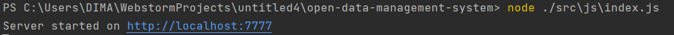
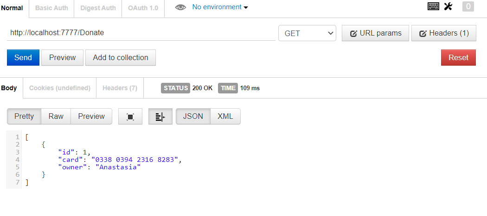
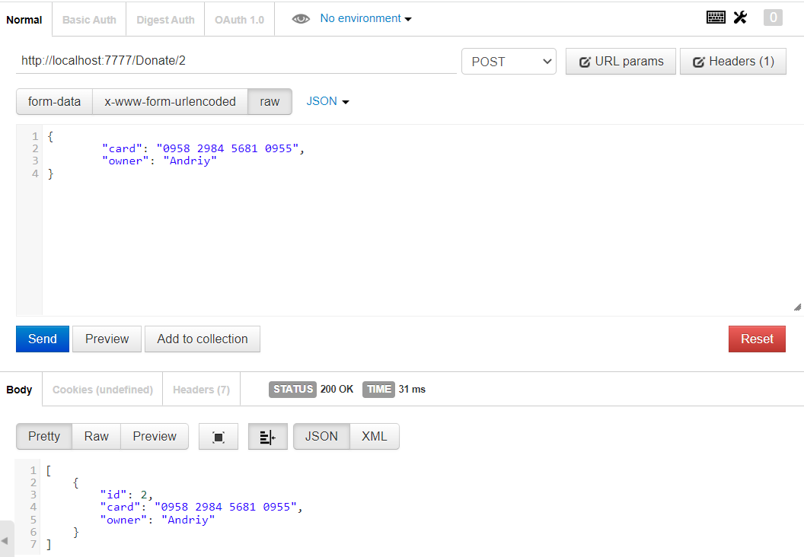
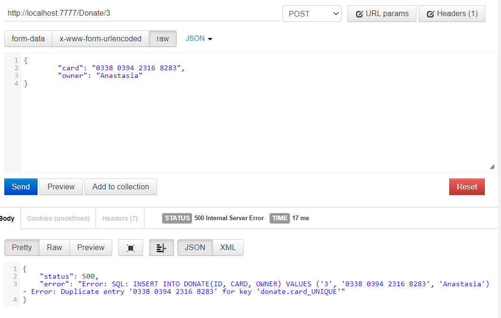
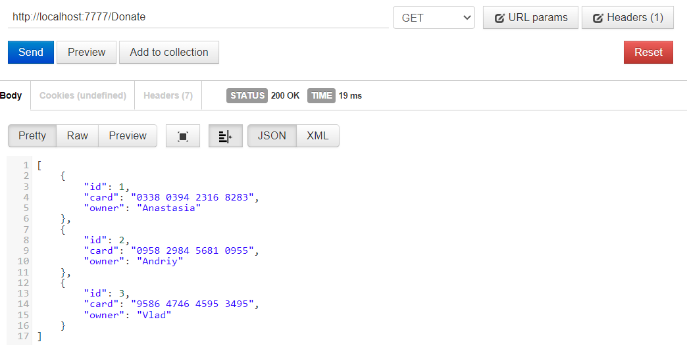
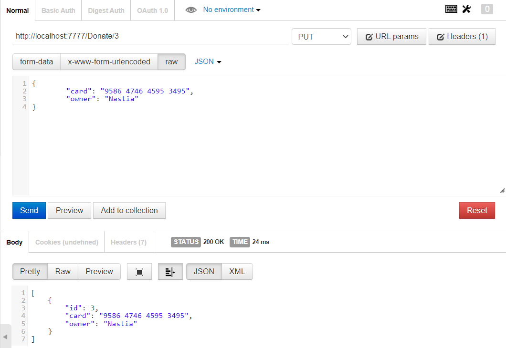
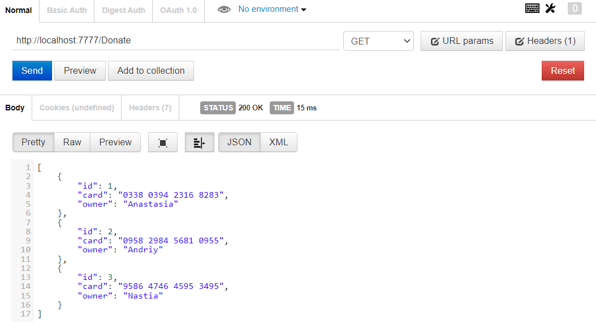
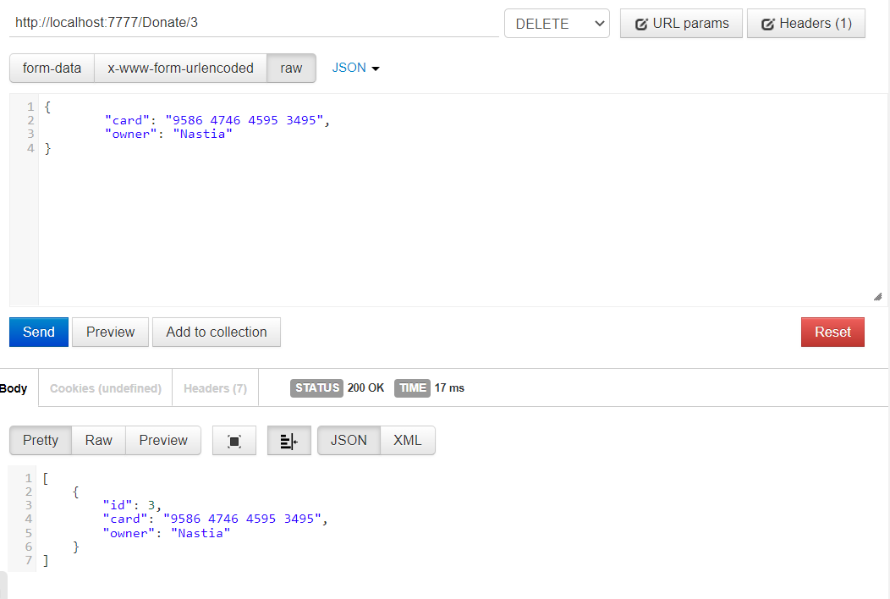
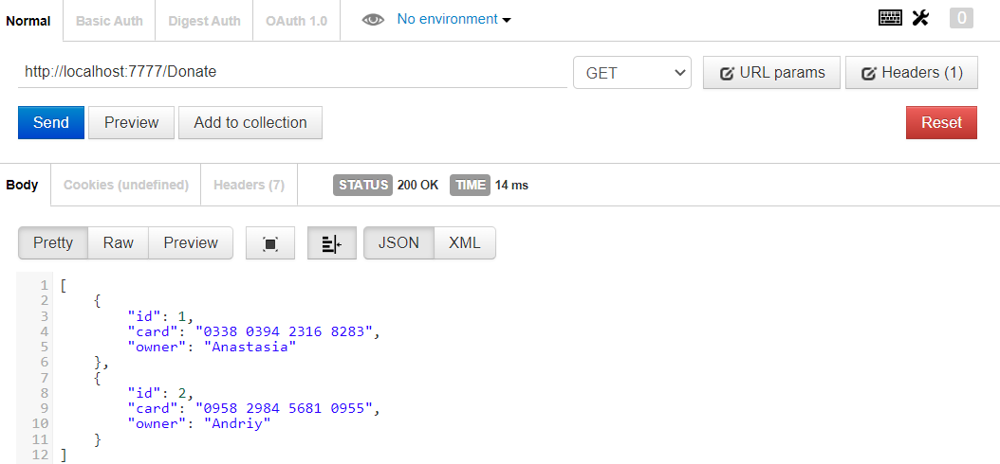

# Тестування працездатності системи

## Запуск сервера на 7777 порті

## Перевірка поточної бази даних (Get)

## Додавання донату(Create)

### Створення нового донату з унікальним id

### Спроба створити донат з id, яке вже зайняте

### Перевірка

## Зміна параметрів донат (Put)

### Зміна параметрів донат

### Перевірка

## Видалення донату (Delete)

### Видалення донату

### Перевірка

