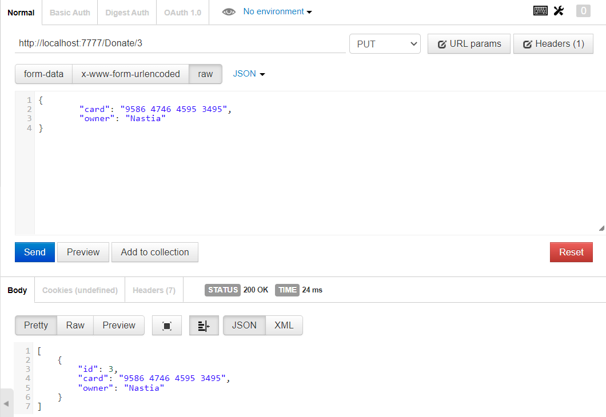
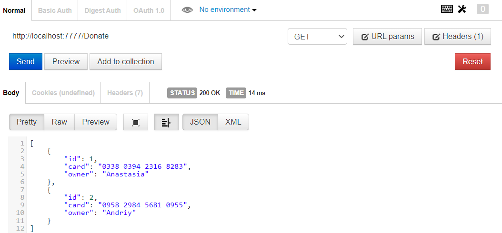

# Тестування працездатності системи

## Запуск сервера на 7777 порті

## Перевірка поточної бази даних (Get)

## Додавання сутності (Create)

### Створення нової сутність з унікальним id

### Спроба створити сутність з id, яке вже зайняте

### Перевірка

## Зміна параметрів сутності (Put)

### Зміна параметрів сутності

### Перевірка

## Видалення сутності (Delete)

### Видалення сутності

### Перевірка
